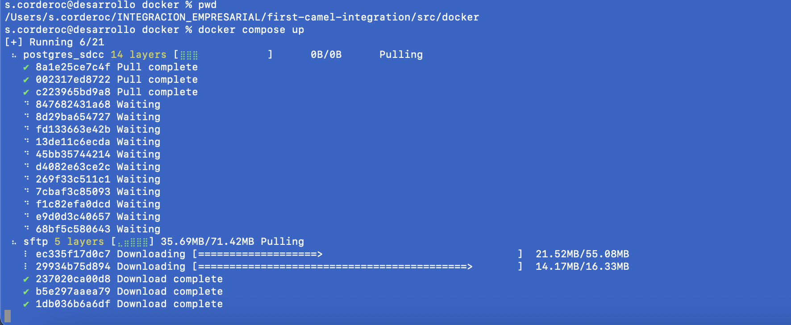
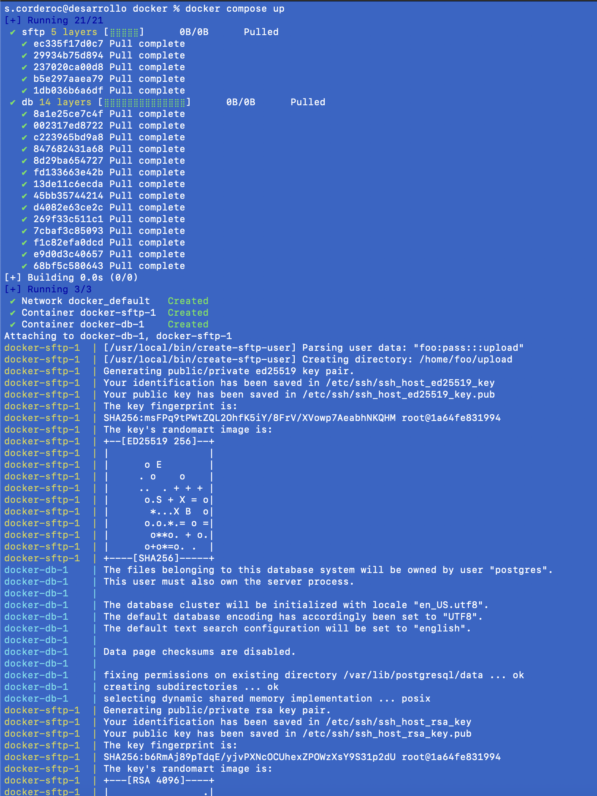
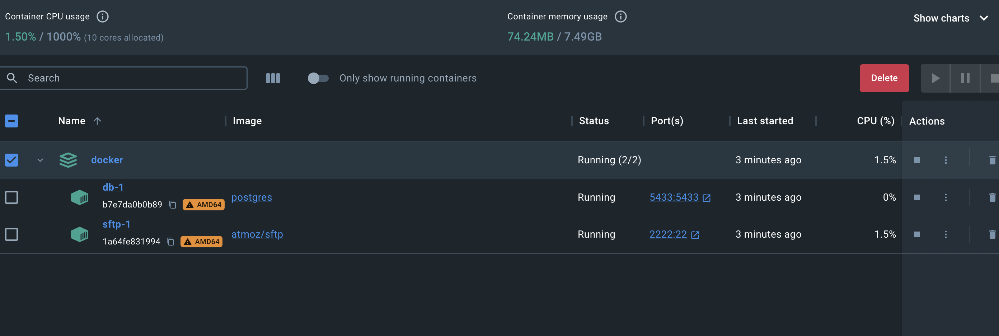
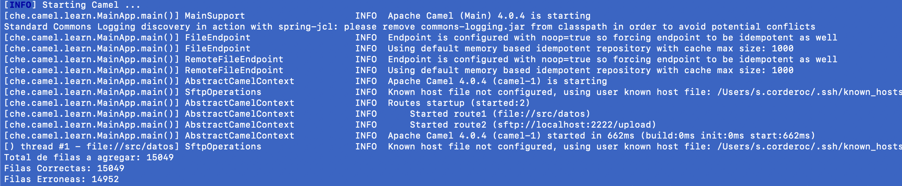
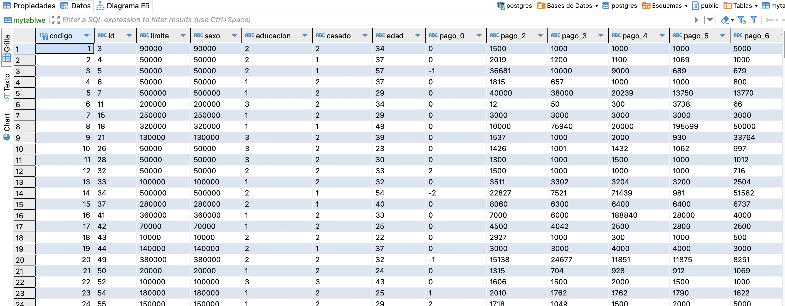

# Integracion fuera de linea

La empresa comercial XYZ tiene una cartera de clientes amplia a nivel nacional, más de 60 mil clientes, a sus clientes se les entrega una tarjeta de afiliación por medio de la cual los cliente realizan compras a crédito y tiene que de manera mensual realizar los pagos de sus compras, la cartera no se recupera de manera rápido teniendo deudas pendientes de cobrar, por lo que la empresa decide compartir información del historial de pagos con un empresa ML1 especializada en elaborar modelos de predicción para determinar si un cliente realizará o no el pago que le corresponde en el mes; la empresa ML1 le solicita información demográfica, la cantidad de días en los que realizó el pago, valores que tenia que pagar y el valor real del pago, posterior a establecer el intercambio de información, las empresas llegan a un acuerdo para que  de manera mensual la empresa XYZ genere la información en archivos planos y se los coloque en un buzón STP de la empresa ML1, posterior la empresa ML1 lee la información de este archivo para cargar en una data de datos y realizar el procesamiento.

Diseñe e implemente por medio de la utilización un framework de integración el proceso de lectura del archivo en formato CSV para posterior a realizar algunas validaciones básicas se ingrese esta información a la base de datos.

El valor de la factura a pagar no puede ser menor o igual a cero.
El valor pagado no puede ser menor o igual a cero.
Al finalizar la carga se solicita que se presente un log o registros en el cual se especifique la cantidad de información que se carga y la que presento errores de validación. 

# Codigo verrsionado
```
https://github.com/scordero1234/first-camel-integration.git
```
# Pasos para ejecutar
ingresamos a la ruta del proyecto  /first-camel-integration/src/docker
```
src/docker
```

```
docker-compose up
```

### creacion





verificamos 




# En caso de tener problemas,ejecutamos lo siguiente

```
docker run -p 2222:22 -d atmoz/sftp foo:pass:::upload
```

Creamos 

```
docker run --name postgres -e POSTGRES_USER=postgres -e POSTGRES_PASSWORD=postgres -p 5432:5432 -d postgres:15
```

levantamoe la base de datos

```
docker exec -it postgres psql -U postgres -d postgres
```

# Ejecucion del proyecto
En la ruta
```
 /first-camel-integration/
 ```

 ejecutamos

 ```
 mvn clean package -DSkipTest
 ```

 posterior

 ```
 mvn camel:run
 ```


# Resulados



## Resultado de la tabla Creada



### Codigo

Crea la tabla en el caso de no haber
```
BasicDataSource dataSource = new BasicDataSource();
                dataSource.setDriverClassName("org.postgresql.Driver");
                dataSource.setUrl("jdbc:postgresql://localhost:5432/postgres");
                dataSource.setUsername("postgres");
                dataSource.setPassword("postgres");
                try (Connection connection = dataSource.getConnection();
                         Statement statement = connection.createStatement()) {
                                String createTableQuery = "CREATE TABLE IF NOT EXISTS datosProcesadosOK (CODIGO SERIAL PRIMARY KEY, ID varchar(10),LIMITE varchar(10),SEXO varchar(10),EDUCACION varchar(10),CASADO varchar(10),EDAD varchar(10),PAGO_0 varchar(10),PAGO_2 varchar(10),PAGO_3 varchar(10),PAGO_4 varchar(10),PAGO_5 varchar(10),PAGO_6 varchar(10),FACTURA_1 varchar(10),FACTURA_2 varchar(10),FACTURA_3 varchar(10),FACTURA_4 varchar(10),FACTURA_5 varchar(10),FACTURA_6 varchar(10),PAY_AMT_1 varchar(10),PAY_AMT_2 varchar(10),PAY_AMT_3 varchar(10),PAY_AMT_4 varchar(10),PAY_AMT_5 varchar(10),PAY_AMT_6 varchar(10),DEFAULT_PAYMENT_NEXT_MONTH varchar(10));";
                        statement.executeUpdate(createTableQuery);
                         } catch (Exception e) {
                        e.printStackTrace();
}    
                         ```
                 
```

El archivo cardclients.csv colocamos en la la ruta sftp        
```
             
                from("file:src/datos?noop=true&fileName=cardsclients.csv")
                        .to("sftp:localhost:2222/upload?username=foo&password=pass");
 ```

 Lee los datos y procesa

 ```
     from("sftp:localhost:2222/upload?noop=true&username=foo&password=pass")
                .unmarshal(bindy)
                .process(new MyProcessor())  
